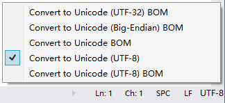

# FileEncoding

[中文](README.zh.md) | English

## What's this?
This Visual Studio Extension will display the charset of current document at the right bottom margin of the editor; Click to popup a contextual menu with a list of encodings and choose the encoding that you want to convert the document to.

Multi-targeting:
- Visual Studio 2022 (17.x)
- Visual Studio 2019 (16.x)

**NOTES**:
1. The file's modification status will be changed to `dirty` (aka Modified), since you'd changed the encoding of the file.
2. UTF-8 as default: When the encoding could be regarded as both UTF-8 and the locale default encoding (e.g. `GB2312`), this app will take it as `UTF-8` instead of the locale default.

## Screenshots



NOTES:
- **UTF-8** (without [BOM](https://docs.microsoft.com/en-us/globalization/encoding/byte-order-mark))
    - `html`|`xhtml`|`_Layout.cshtml`: It is not necessary to use a BOM if a output template has already pointed out its `charset=utf-8`.
    - `PHP`: In case of PHP files are usually as a template to output, it is not a good idea to save PHP files with the BOM at the beginning. Do not add BOM to a script file that cannot be correctly processed by its interpretor. 
    - `JSON`: Implementations must not add a **byte order mark** to the beginning of a JSON text. [[RFC 7159, Section 8.1]](https://www.rfc-editor.org/rfc/rfc7159#section-8.1) 
    - `sh`: POSIX (Unix-like) scripts are required to start with '#!' (e.g. `#!/bin/sh`, `#!/bin/bash`), so you MUST NOT add a BOM to the beginning.
- **UTF-8 BOM**
    - IMHO, it is recommended for a document without an indicator of charset or reader, and it posiblbly contains multi-byte characters, for two reasons:
        1. BOM is actually the most efficient way of identifying an UTF-8 file.
        2. Most modern applications and standards support and encourage the use of BOM.
        
## License
[MIT License](LICENSE.txt)  
```
Copyright (c) 2021 genrwoody
Copyright (c) 2022 Myvas Foundation
```  
This repo was forked from _FileEncoding_ by **genrwoody**;  This release version solved an issue of confusing display for locale encoding and re-publish by Myvas Foundation.

See [README](https://github.com/myvas/FileEncoding) for details.
