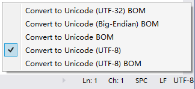

# FileEncoding

中文 | [English](README.md)

## 介绍
本 Visual Studio 扩展（vsix）在Visual Studio的编辑器边栏的右下角显示文档的编码, 点击后可修改为您指定的编码。

支持版本：
- Visual Studio 2022 (17.x)
- Visual Studio 2019 (16.x)

说明：
- **文件状态**：若切换到另一编码，则文件状态将被标记为`未保存`状态。
- **默认编码**：文件编码默认为`UTF-8`，而不是此前的本地默认编码（例如GB2312)。

## Screenshots



网上关于UTF-8 BOM的讨论很多，以下观点仅供参考：
- **UTF-8** (不带BOM)
    - `html`|`xhtml`|`_Layout.cshtml`：选择这个选项。因为文本中已经通过`charset=utf-8`指定了字符集。
    - `PHP`：与一个输出文件模板相似，通常将内容解析后直接发送给了客户端，因此通常不带BOM。
    - `JSON`：不要带BOM。[[RFC 7159, Section 8.1]](https://www.rfc-editor.org/rfc/rfc7159#section-8.1)
    - `sh`：POSIX (Unix-like)脚本文件在第一行就已经指定了处理该脚本的程序，双方直接约定好了不带BOM。
    - **不可能**有多字节字符的文件，不必带BOM。
- **UTF-8 BOM**
    - 含有多字节字符的文档，如果处理程序支持带BOM，我觉得应当用这个选项，既可以加快字节流处理速度，又可以避免一些*莫名其妙*乱码或字符丢失的问题。
    - 文件本身将被作为输出模板时，一定要站在对方（将接收您的输出数据的程序）的角度考虑问题，搞清楚她是如何要求的。

## License
[MIT](LICENSE.txt)

简而言之，您可以针对本程序做任何修改（包括且不限于命名、徽标、源代码），也可以自由分发或再发布。我们只希望您保留以下授权声明：
```
Copyright (c) 2021 genrwoody
Copyright (c) 2022 Myvas Foundation
```
（您的声明可以附加在上述声明之后。）